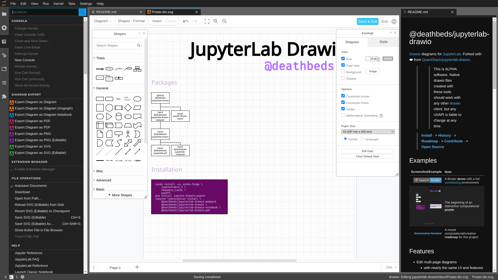

# @deathbeds/jupyterlab-drawio

[Drawio][] diagrams for [JupyterLab][]. Forked with ❤️ from [QuantStack/jupyterlab-drawio][].

> **[Install](#installation)** &middot; > **[History](./CHANGELOG.md)** &middot; > **[Roadmap](./docs/ROADMAP.dio.ipynb)** &middot; > **[Contribute](./CONTRIBUTING.md)** &middot; > **[Open Source](#open-source)**

> > 
> >
> > This is ALPHA software. Native drawio files created with these tools _should_ work
> > with any other [drawio][] client, but any UI/API is liable to change at any time.

[binder]: http://mybinder.org/v2/gh/deathbeds/jupyterlab-drawio/master?urlpath=lab/tree/docs/Poster.dio.svg
[binder-badge]: https://mybinder.org/badge_logo.svg

## Examples

|                                                                             Screenshot/Example | Note                                                                        |
| ---------------------------------------------------------------------------------------------: | :-------------------------------------------------------------------------- |
|                                                                    [![binder-badge][]][binder] | A Binder **demo** with a full [contributing](./CONTRIBUTING.md) environment |
| [](./docs/_static/images/poster.png) | Screenshot of drawio "minimal" UI with export options                       |
|                       [](./docs/Poster.dio.svg) | The beginning of an interactive computational **poster**                    |
|                                               [~~Screenshot Needed~](./docs/ROADMAP.dio.ipynb) | A mixed computational/creative **roadmap** for this project                 |

## Features

- Edit multi-page diagrams
  - with nearly the same UI and features as [diagrams.net][drawio]
  - in many file formats
    - Drawio/mxgraph XML, SVG, PNG
    - or Jupyter Notebooks

> - Experimental: Export print-quality PDF from diagrams (_beware: some **heavy** dependencies_)
>   - include editable Drawio metadata

## Usage

- Try on [![binder-badge][]][binder]
  - or follow the [Installation instructions](#installation) and **Start JupyterLab**
- Import a `drawio` from [diagrams.net](https://diagrams.net) with the _[File Manager][]_
  - or create a new  _Diagram_ from the [Launcher][]
- Use the _[Command Palette][]_ to _Export Diagram_ to various formats

[command palette]: https://jupyterlab.readthedocs.io/en/stable/user/commands.html?highlight=command%20palette
[launcher]: https://jupyterlab.readthedocs.io/en/stable/user/files.html?highlight=Launcher#creating-files-and-activities
[file manager]: https://jupyterlab.readthedocs.io/en/stable/user/files.html

## Installation

### Prerequisites

- `jupyterlab >=2.2,<3`
- `nodejs >=10`

> For example:
>
> ```bash
> conda install -yc conda-forge jupyterlab=2.2 nodejs=12
> ```

### Core Lab Extensions

> **Packages not released yet**. For now, see [CONTRIBUTING.md][].

The core labextensions do not have any server-side dependencies.

```bash
jupyter labextension install \
    @deathbeds/jupyterlab-drawio \
    @deathbeds/jupyterlab-drawio-notebook \
    @deathbeds/jupyterlab-drawio-webpack
```

### PDF: Lab and Server extensions

`@deathbeds/jupyterlab-drawio-pdf` and `jupyter-drawio-export` can generate
print-quality PDF. This approach relies on a headless browser, powered by `jgraph/drawio-image-export2` and ultimately `puppeteer` and has a number of heavy-weight
dependencies. To enable all the bells and whistles get:

- `pypdf2` and `requests_cache` from `pip` or `conda`
- `nodejs>10` from `conda` or your system package manager
  - **NOTE**: this relies on being able to install `puppeteer` (and other
    **arbitrary dependencies** with `jlpm` for now **when first used**
    - _we'll figure out a better approach soon enough_
- **native dependencies** as required to appease `puppeteer`
  - if running in `docker`, this can be a bit trial-and-error
  - for more, see the [binder](./binder/apt.txt) and ~~CI~~.

> For example:
>
> ```bash
> conda install -yc conda-forge pypdf2 requests_cache nodejs
> pip install jupyter-drawio-export
> jupyter serverextension enable --sys-prefix --py jupyter_drawio_export
> jupyter labextension install @deathbeds/jupyterlab-drawio-pdf
> ```

## Open Source

### License

All files herein, unless otherwise noted, are free software licensed under [Apache 2.0](./LICENSE.txt).

### Copyright

The copyright holders of this extension are the [contributors][] to this repository.

Portions of the JupyterLab components are derived from [QuantStack/jupyterlab-drawio][].

The copyright holders of drawio and drawio-export is [jgraph](http://www.jgraph.com).

The original source code vendored in this package from:

- [@jgraph/drawio][]
- [@jgraph/draw-image-export2][]

[@jgraph/drawio]: https://github.com/jgraph/drawio
[@jgraph/draw-image-export2]: https://github.com/jgraph/draw-image-export2
[contributing.md]: ./CONTRIBUTING.md
[jupyterlab]: https://github.com/jupyterlab/jupyterlab
[drawio]: https://www.diagrams.net
[quantstack/jupyterlab-drawio]: https://github.com/QuantStack/jupyterlab-drawio
[contributors]: https://github.com/deathbeds/jupyterlab-drawio/graphs/contributors
